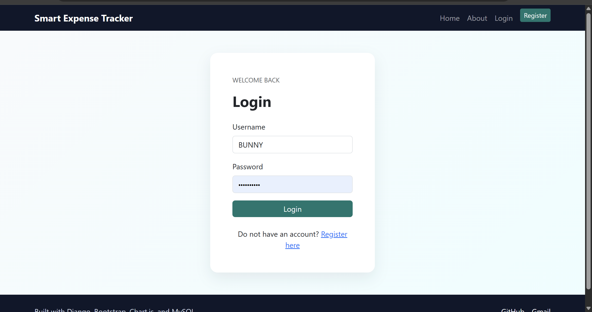
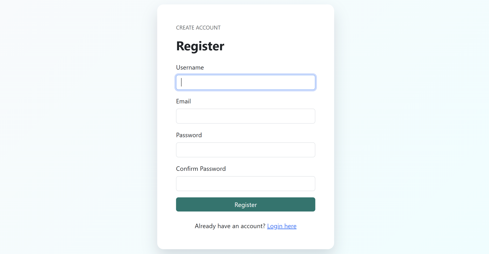
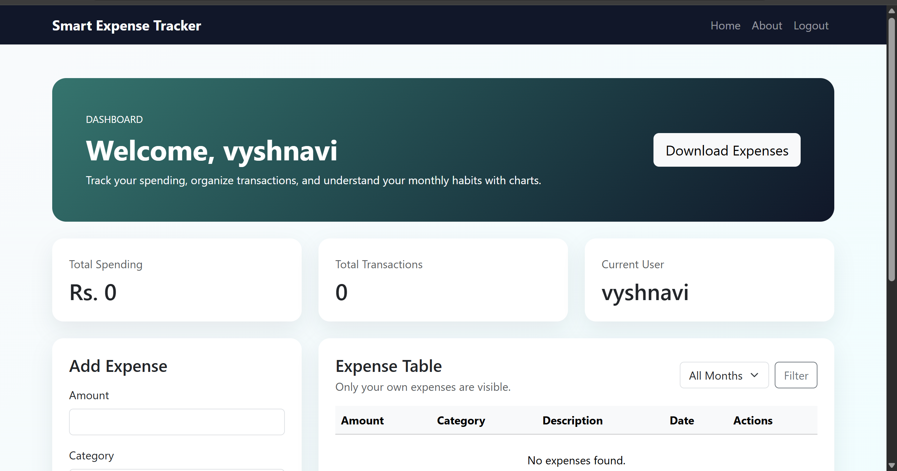
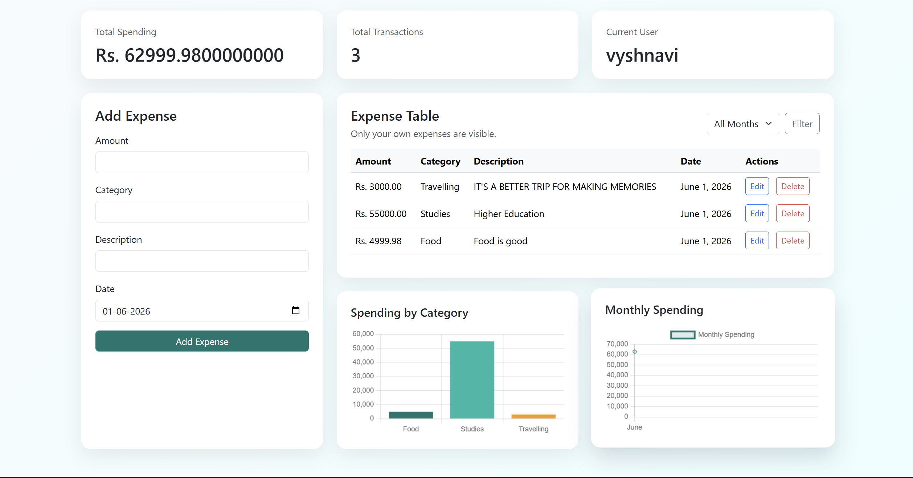
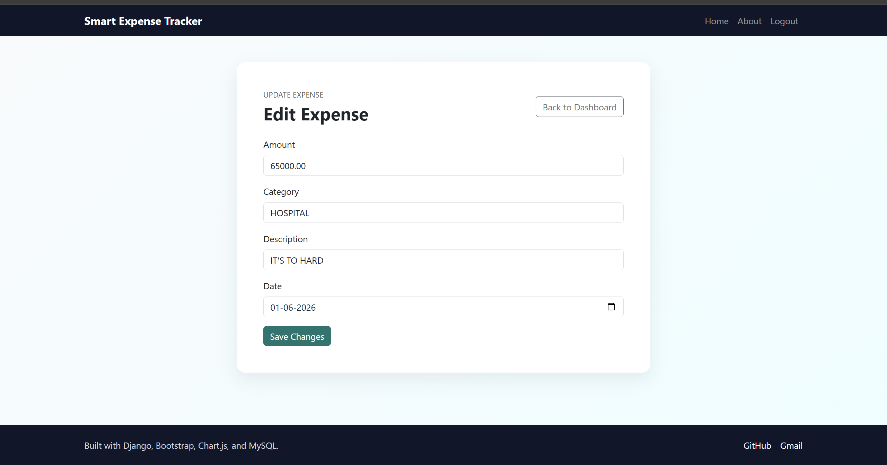
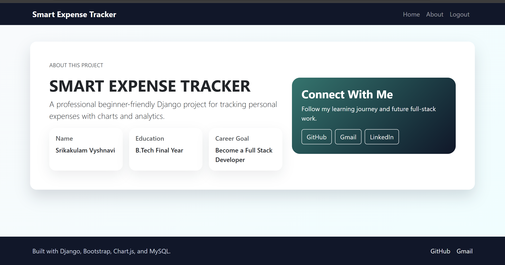

# 💰 Smart Expense Tracker

A modern and user-friendly **Expense Management Web Application** built with **Django** that helps users track, manage, and analyze their daily expenses efficiently.

This project was developed to practice real-world Django development concepts including authentication, CRUD operations, database management, data visualization, and deployment.

---

## 🚀 Features

### 🔐 User Authentication
- User Registration
- Secure Login & Logout
- User-specific expense management

### 💵 Expense Management
- Add new expenses
- Edit existing expenses
- Delete expenses
- View personal expenses only

### 📊 Analytics & Insights
- Total spending summary
- Category-wise expense analysis
- Monthly spending trends
- Interactive charts using Chart.js

### 🔍 Filtering
- Filter expenses by month
- Easy expense tracking and monitoring

### 📄 Export Functionality
- Download expense records as CSV

### 👤 About Section
- Personal profile information
- Professional links integration

### ⚙️ Admin Support
- Django Admin Panel for management

---

## 📸 Project Screenshots

### 🔐 Login Page


### 📝 Registration Page


### 🏠 Dashboard


### 📊 Expense Analytics


### ✏️ Edit Expense Feature


### 👤 About Page


---

## 🛠️ Tech Stack

### Backend
- Python
- Django

### Frontend
- HTML5
- CSS3
- Bootstrap 5

### Database
- SQLite (Development)
- PostgreSQL (Deployment)

### Data Visualization
- Chart.js

### Deployment
- Render

### Version Control
- Git & GitHub

---

## 📂 Project Structure

```text
expense_tracker_project/
│
├── build.sh
├── manage.py
├── requirements.txt
├── README.md
│
├── expense_tracker/
│   ├── settings.py
│   ├── urls.py
│   ├── asgi.py
│   └── wsgi.py
│
└── expenses/
    ├── admin.py
    ├── apps.py
    ├── forms.py
    ├── models.py
    ├── urls.py
    ├── views.py
    ├── migrations/
    └── templates/
        ├── base.html
        ├── home.html
        ├── login.html
        ├── register.html
        ├── edit.html
        └── about.html
```

---

## ⚙️ Installation & Setup

### 1️⃣ Clone the Repository

```bash
git clone https://github.com/Vyshnavi132005/smart-expense-tracker.git
```

### 2️⃣ Navigate to the Project Folder

```bash
cd smart-expense-tracker
```

### 3️⃣ Create Virtual Environment

```bash
python -m venv venv
```

### 4️⃣ Activate Virtual Environment

**Windows**

```bash
venv\Scripts\activate
```

**Mac/Linux**

```bash
source venv/bin/activate
```

### 5️⃣ Install Dependencies

```bash
pip install -r requirements.txt
```

### 6️⃣ Apply Migrations

```bash
python manage.py migrate
```

### 7️⃣ Run the Server

```bash
python manage.py runserver
```

Open:

```text
http://127.0.0.1:8000/
```

---

## 🎯 Learning Outcomes

Through this project, I gained hands-on experience with:

- Django Authentication System
- CRUD Operations
- Database Design & Models
- Django ORM
- Template Inheritance
- Data Visualization using Chart.js
- User-specific Data Security
- Git & GitHub Workflow
- Web Application Deployment

---

## 👩‍💻 Author

**Srikakulam Vyshnavi**

B.Tech Final Year Student | Python & Django Developer | Aspiring Cloud Engineer

### Connect With Me

- LinkedIn: https://www.linkedin.com/in/vyshnavi-srikakulam
- GitHub: https://github.com/Vyshnavi132005

---

⭐ If you found this project useful, consider giving it a star on GitHub!
